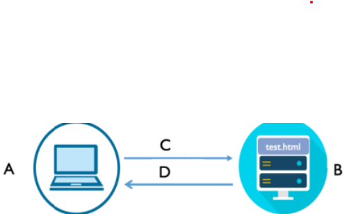
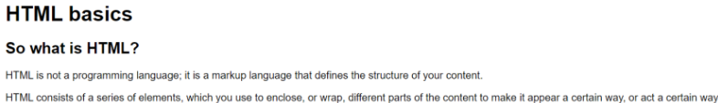

##### Note
- HTML is declarative language
- use `!` to generate basic HTML template
- `<head> </head>`:	a container for metadata
- `<meta charset="UTF-8">`
	- tell browser to **decode** bytes using UTF-8 to get correct characters
- text editor **encode** characters in the HTML file into bytes with UTF-8 by default
- `<meta name="viewport" content="width=device-width, initial-scale=1.0"`
	- `width=device-width`: 	width of the page = screen-width of the device
	- `initial-scale=1.0`: 		initial zoom level when the page is loaded
- install `open in browser` extension in VS code and use `ALT + B` to display HTML in browser
- install `live server` extension in VS code and right click to select `Open with Live Server`
- press `Ctrl + Shift + V` to display markdown file in VS code
- **GIT COMMANDS**
	- `git config --gloabl user.email "pchen@my.bcit.ca"`
	- `git config --global user.name "mundo"`
	- `git commit --amend`		edit the currently committed message 

##### Q1
1. Imagine that a user types `http://www.example.com/test.html` in a browser address bar on A.
	
	1. Is `A` an HTTP client or server? What about `B`?
		1. HTTP client: 	`A`
		2. HTTP server: 	`B`
	2. Are `C` and `D` requests or response?
		1. Request:		`C`
		2. Response:		`D`
	3. Which of the following data is being sent through each `C` and `D`?
		1. URL						`C`		full URL
		2. HTTP method				`C`		GET, POST or PUT request
		3. Status code				`D`		
		4. Files (specify what file)	`D`		`test.html`

2. Imagine the following code exists in the data received by `A` in `D`:
	``
	When the browser comes across that code/line, `E` and `F` happen. Note `C` and `D` happen first before `E` and `F`
    
	1. Are `E` and `F` request or response?
		1. Request		`E`
		2. Response		`F`
	2. Which of the following data is being sent thru each `E` and `F`?
		1. URL							`E`		`/field.jgp` or full URL
		2. HTTP method					`E`		GET, POST or PUT request
		3. Status code					`F`
		4. Files (specify what files)		`F`		`filed.jpg`

3. Imagine `field.jpg` cannot be found in `B`
	1. Will all `C`, `D`, `E`, `F` still happen?
		1. Yes
	2. How would `A` know that picture wasn't found? Does any `C`, `D`, `E` and `F` contain the info where the picture is not found?
		1. `A` receives the status code `404: Not Found`
		2. The status code, `404: Not Found`, is contained in `F`

##### Q2
###### Render this text as following:
- **Note**: 
	- "HTML basics" is the most important heading
	- "So what is HTML?" is the second most important heading 
	
- Text to copy
	- "HTML basics So what is HTML? HTML is not a programming language; it is a markup language that defines the structure of your content. HTML consists of a series of elements, which you use to enclose, or wrap, different parts of the content to make it appear a certain way, or act a certain way. "